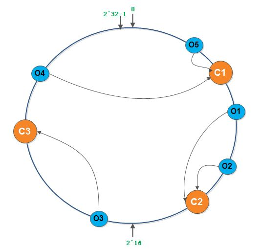
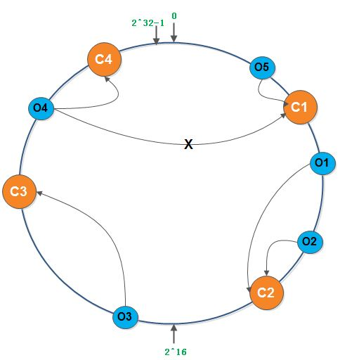
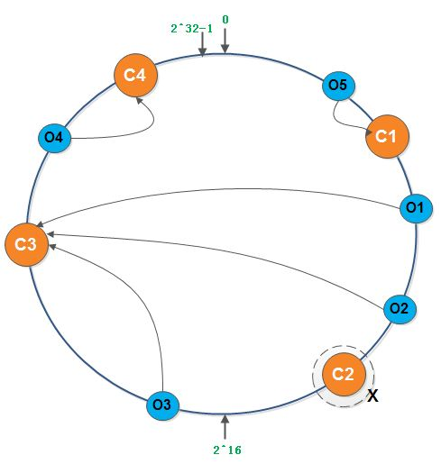

# Memcached一致性哈希

徐顺 2013-09-07

## 背景
由于一致性哈希算法具有简单、快速、稳定和负载分配好等优点，目前服务器负载均衡算法最常用的是一致性哈希算法。其他算法有：轮循算法(Round Robin)、最少连接算法(Least Connection)、加权法(Weighted )等。

**典型的应用场景**：
有N台服务器提供缓存服务，标记为Cache1,Cache2,...,Cachen。需要对服务器进行负载均衡，将对象Object i尽可能的平均分发到每台服务器上。

普通方法：
`serverNodeID = hash(object) % N`

缺陷：

1. 当有一台服务器Cachei宕机，则Cachei上面的所有缓存对象都失效，此外，由于服务器数量为N-1, `serverNodeID = hash(object) % (N-1)`
2. 当请求频繁，添加新的服务器，则`serverNodeID = hash(object) % (N-1)`

上面两种情况几乎会导致所有的缓存对象都失效，对缓存服务器的性能都有极大的影响，不利于服务器扩展。

主角登场--一致性哈希算法

## 一致性哈希

### 起源
Consistent Hashing算法由David Karger等人在1997年的论文`Consistent Hashing and Random Trees::Distributed Caching Protocols for Relieving Hot Spots on the World Wide Web`中提出，目前在cache系统中应用越来越广泛。

### 单调性
单调性是指如果已经有一些对象通过哈希分派到了相应的缓存服务器中，又有新的缓存服务器加入到系统中。哈希的结果应能够保证原有已分配的内容可以被映射到新的缓存服务器中，而不会被映射到旧的缓存服务器上,也就是已映射好的缓存对象尽可能小的改变已存在的Object->Cache映射关系。

### 平衡性
平衡性是指通过hash能够使对象尽可能分布到所有的缓存服务器中，这样可以使得所有的缓存服务器都得到有效利用，满足负载均衡的要求。

### 算法描述

* 缓存服务器和对象具有相同的hash算法，对应一个整数值(unsigned int)，因此其值分配在[0, 2^32-1]区间上，可以想象成一个收尾相接的圆环。
* 通过hash(Cache i)函数求出服务器Cache i的hash值，依次映射到圆环相应的点上。
* 对于每个对象Object i，通过hash函数求出其hash值
    * 若hash(Cache p-1) < hash(Object i) <= hash(Cache p)，则Object i映射到服务器Cache p上
    * 若hash(Object i) > max(hash(Object p))，则映射到hash值最小的服务器上

### 案例描述

假如存在3台缓存服务器，n个缓存对象，它们之间的映射关系如下所示。

	hash(Cache 1) = C1
	hash(Cache 2) = C2
	...
	hash(Object 1) = O1
	hash(Object 2) = O2
	...

### 添加cache服务器

当有大量请求到来时，添加一台新的cache 4服务器，假设hash(cache 4)被映射在O4和O5之间。这时受影响的对象是其hash值处在(C3,C4]区间的缓存对象，这些对象将重新映射到Cache 4服务器上，其他对象不受影响，很好的满足了单调性。

### 删除cache服务器

假如服务器Cache 2宕机了，程序在请求此服务器上的对象时将向Cache 3服务器发送请求，而Cache 3服务器上没有存储这些对象，因此程序将会从数据库或其他地方读取相关值然后存储在Cache 3服务器中，这样就完成了缓存对象的转移。同样，也满足了单调性。

### 虚拟节点

引进虚拟节点是因为在服务器数量较少的情况下，通过hash(key)算出节点的哈希值在圆环上并不均匀分布(稀疏)，仍然会出现各节点负载不均衡的问题。

虚拟节点可以看作是实际节点的复制品(replicas)，其功能与实际节点一样，它们各自拥有不同的key。例如当服务器数量很小时，可通过按照一定的比例(如100倍)将服务器数量扩大成相应的虚拟节点数量，也就是一个实际节点对应多个虚拟节点，然后计算各虚拟节点的hash值映射到圆环上。在进行负载均衡时候，落到虚拟节点上的对象将存储到实际服务器上。

### 一致性哈希实现

代码来源于`https://weblogs.java.net/blog/2007/11/27/consistent-hashing`省略了具体的hash算法，提供了一致性Hash算法的主要框架。

	import java.util.Collection;
	import java.util.SortedMap;
	import java.util.TreeMap;

	public class ConsistentHash<T> {

	 private final HashFunction hashFunction;
	 private final int numberOfReplicas;
	 private final SortedMap<Integer, T> circle = new TreeMap<Integer, T>();

	 public ConsistentHash(HashFunction hashFunction, int numberOfReplicas,
	     Collection<T> nodes) {
	   this.hashFunction = hashFunction;
	   this.numberOfReplicas = numberOfReplicas;

	   for (T node : nodes) {
	     add(node);
	   }
	 }

	 public void add(T node) {
	   for (int i = 0; i < numberOfReplicas; i++) {
	     circle.put(hashFunction.hash(node.toString() + i), node);
	   }
	 }

	 public void remove(T node) {
	   for (int i = 0; i < numberOfReplicas; i++) {
	     circle.remove(hashFunction.hash(node.toString() + i));
	   }
	 }

	 public T get(Object key) {
	   if (circle.isEmpty()) {
	     return null;
	   }
	   int hash = hashFunction.hash(key);
	   if (!circle.containsKey(hash)) {
	     SortedMap<Integer, T> tailMap = circle.tailMap(hash);
	     hash = tailMap.isEmpty() ? circle.firstKey() : tailMap.firstKey();
	   }
	   return circle.get(hash);
	 }

	}

参考资料

http://developer.51cto.com/art/201104/254419.htm  
http://dl.acm.org/citation.cfm?id=258660  
https://weblogs.java.net/blog/2007/11/27/consistent-hashing  
http://www.codeproject.com/Articles/56138/Consistent-hashing  